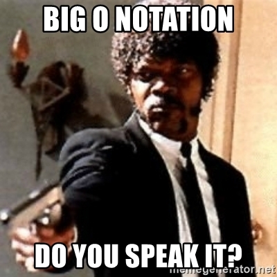
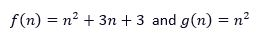
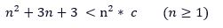
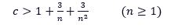
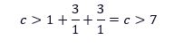
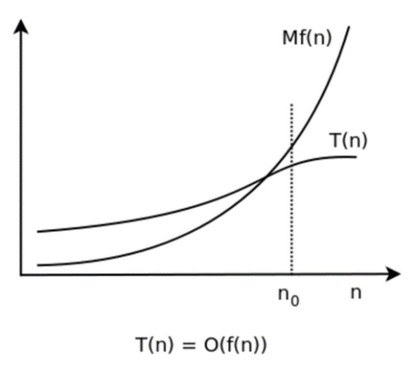

# Big-O-Notation



## Table of contents
* [What is Big O Notation](#What-is-Big-O-Notation )
* [Asymptotic Growth and the Formal Mathematical Definition of Big O](#Asymptotic-Growth-and-the-Formal-Mathematical-Definition-of-Big-O)
* [Types of Time Complexity](#Types-of-Time-Complexity)
* [Analyzing Algorithms to Determine Big O](#Analyzing-Algorithms-to-Determine-Big-O)
* [Why Bother with Big O](#Why-Bother-with-Big-O)
* [Sources](#Sources)

## What is Big O Notation
Big O notation is used in Computer Science to describe the performance of an algorithm, usually for the worst-case scenario. More specifically, Big O notation evaluates the efficiency of an algorithm as the number of input items, usually represented by the variable n, approaches infinity. Big O was first introduced by Paul Bachmann in 1894 and later popularized by Edmund Landau and others (Graham, et al., 443). It gets its name from the literal "Big O" in front of the estimated asymptotic rate of growth. Big O notation doesn't tell the speed of the algorithm in seconds as there are too many factors that influence the time an algorithm takes to run on any given hardware, but it does indicate how fast an algorithm’s runtime grows as input size grows and will allow for comparisons to be made with other algorithms regarding efficiency. Asymptotic analysis provides the means to assess the performance of an algorithm as input values grow and make these comparisons.

## Asymptotic Growth and the Formal Mathematical Definition of Big O
Asymptotic growth refers to the growth rate of a function as the independent variable approaches a limit that it will never reach. If f(n)  is a function representing the number of operations an algorithm must perform for n  number of inputs, then how fast the slope of f(n)  increases as n approaches infinity is what is examined to determine asymptotic growth. This is what Big O notation is concerned with, the parts of the function that affect the growth rate as n approaches infinity. This allows for the elimination of constants and variables with smaller exponents, which is why big O notation doesn’t use constants and normally consists of a single variable.

To illustrate this more mathematically, consider two functions:



Clearly, f(n) will always have a larger output than g(n) when n is positive, however, it is possible to multiply g(n) by some constant so that after a certain point, it is always greater than f(n). Since f(n) has a constant, it will always be greater than g(n) when n is 0 therefore the domain should be restricted to 1 or greater.



Solving for c  gives us:



Since the variables are all in the denominator, the highest possible value on the right side of the inequality occurs when n is 1 and decreases as n increases (larger denominator means a smaller fraction). Solving the inequality when n=1 gives us:



Thus, when c is greater than 7, the inequality n^2+3n+3 <n^2* c    (n≥1) is true. Figure 1 below displays the graph of n^2+3n+3 (blue) and 8n^2 (red). As the graph shows, f(n) is bounded above by g(n)*8 for n≥1. What this means is that once n≥1, f(n) will never be greater than g(n)*8 which implies that its rate of growth will never exceed g(n)*8. 
<p float="left">
  
</p>
Because 8 is a constant, it has no effect on the asymptotic growth of 8n^2. The 8 is not causing the change in slope to accelerate as n increases, the n^2 is. Therefore, the asymptotic rate of growth for 8n^2 is just n^2 and because f(n) is contained by 8n^2, it too has asymptotic rate of growth of n^2. In terms of Big O, it can be said that f(n) is in Big O of g(n). The Big O notation for f(n) would therefore be O(n^2).
With a rudimentary understanding of asymptotic growth at hand, a formal mathematical definition for Big O notation becomes more tangible to understand:

>Let T(n) and f(n) be two positive functions. We write T(n) ∊ O(f(n)) and say that T(n) has order of f(n), if there are positive constants M and n₀ such that T(n) ≤ M·f(n) for  all n ≥ n₀. Where T(n) ∊ O(f(n)) means that T(n) doesn't grow faster than f(n). The graph below shows that all the conditions in the definition are met (“Big O notation: definition and examples” ). 




## Types of Time Complexity
<p float="left">
  
   
</p>


**Constant Time Complexity O(1)**<br />
Constant time complexity for an algorithm means that increasing the input size has no effect on the efficiency of the algorithm. Consider a function that prints the first item in a list. Increasing the size of the elements in list does not increase the runtime of the algorithm. The function below has a Big O of O(1) time (or "constant time") relative to its input. The array could be 1 item or 1,000 items, but this function would still only perform one operation.
```c++
void displayFirstElement(int arr[])
{
    cout << arr[0];
}
```
**Logarithmic Time Complexity O (log n)**<br />
Logarithmic time is only slightly worse (relative to other types of time complexity) than constant time given a large enough value for n. Logarithmic growth is fast initially but begins to flat out as n grows large. The actual base value of the logarithm does not matter for purposes of comparing time complexity as all logarithmic bases can be converted to any other base through multiplication of a constant (refer logarithmic change of base equation). The binary search is an example of logarithmic time complexity. Here, the base is 2. This means that for a list of 16 elements, the worst case scenario search result would be 4 (log(2)16 = 4). A more simple example of O(log n) time is shown below. Notice, the for loop does not increment itself by a constant amount each iteration.
```c++
void displayPartialArr(int arr[], int n)
{
    for(int i = 1; i < n; i*= 2)
    {
         cout << arr[i];
    }
}
```
**Linear Time Complexity O(n)**<br />
With linear time complexity, growth rate is constant. This means that for each increase in n, the exact same number of additional operations must be performed. This makes sense when thinking about the slope of a non-horizontal line on a graph, the rate of change is constant. An example of linear time complexity would be searching for the max value in a list or printing each value in a list. The function below has O(n) time complexity, where n is the number of items in the array. If the array has 10 items, 10 print operations are performed. If it has 1000 items, 1000 print operations are performed.
```c++
void displayArray(int arr [] int n)
{
    for(int i = 0; i < n; i++)
    {
        cout << arr[i];
    }
}
```
**Linearithmic Time Complexity O(n log n)**<br />
Linearithmic time complexity is a combination of linear and logarithmic. This type of time complexities ‘s rate of growth increases faster than any previously discussed time complexity but is starts to have a semblance to linear time complexity when n grows large enough since the logarithmic part grows slower as n grows larger. Well known sorting algorithms such as merge sort, quick sort, and heap sort can be classified as having linearithmic runtime. Nested for loops, the outer incrementing its index by one while the inner increments by ten times the previous amount provides some insight as to why this time complexity has O(n log n) runtime.
```c++
void displayArrays(int arrA[], int arrB[], int n)
{
    for(int i = 0; i < n; i++)
    {
        fpr(int j = 1; j < n; j*=10)
        {
              cout << arrA[i];
              cout << arrB[j];
        }
    }
}
```
**Quadratic Time Complexity O(n^2)**<br />
With quadratic time complexity, the rate of growth is increasing faster as n grows larger and there is no leveling off like with linearithmic. An example of an algorithm that has this type to time complexity would be any function that makes use of nested loops, each iterating through n number of items. If an array has n items, the outer loop runs n times and the inner loop runs n times for each iteration of the outer loop, resulting in a total of n*n iterations. Thus, the Big O of this function is  O(n^2).
```c++
void display2DArray(int arr[][n])
{
    for(int i = 0; i < n; i++)
    {
        fpr(int j = 0; j < n; j++)
        {
              cout << arr[i][j];
        }
    }
}
```
**Exponential Time O and Factorial Time O (n!) Complexity**<br />
Exponential and Factorial time complexities have the fastest accelerating growth rates of any type of time complexity with factorial being the faster of the two. Generally, these types of time complexities should be avoided if performance is valued however, some instances do utilize these time complexities. An example of an algorithm that uses exponential time complexity would be one that attempts to brute force a password by testing every possible numerical combination for a password of n length.


## Analyzing Algorithms to Determine Big O

## Why Bother with Big O

## Sources
Nickels, Megan, et al. “Computer Programming: Algorithm for Mathematics Exploration!” Elementary STEM Journal, vol. 23, no. 2, Dec. 2018, pp. 14–17. EBSCOhost, search-ebscohost-com.ezproxy.hacc.edu/login.aspx?direct=true&db=f5h&AN=143868392&site=ehost-live&scope=site.

GRANT, ANDREW. “Computer Algorithm Masters Poker.” Science News, vol. 187, no. 3, Feb. 2015, p. 14. EBSCOhost, doi:10.1002/scin.2015.187003016.

Sumser, Audrey. “Collaboration in Computer Science: Working Together/Using Pseudocode: Instructions in Plain English/Algorithms: The Building Blocks of Computer Programming….” School Library Journal, Oct. 2018, pp. 34–35. EBSCOhost, search-ebscohost-com.ezproxy.hacc.edu/login.aspx?direct=true&db=f5h&AN=132770052&site=ehost-live&scope=site.

“Big O Notation” Wikipedia, Wikimedia Foundation, 8 November, 2021, https://en.wikipedia.org/wiki/Big_O_notation 

Dedov, Florian. The Bible of Algorithms and Data Structures: A Complex Subject Simply Explained (Runtime Complexity, Big O Notation, Programming). NeuralNine, 2020

Graham, Ronald, et al. Concrete Mathematics: A Foundation for Computer Science. Addison-Wesley, 1998

Briggs, William, et al. Single Variable Calculus. Pearson Education, Inc., 2015.

Blitzer, Robert. Precalculus. Pearson Education, Inc., 2014.

“Big O notation: definition and examples.” yourbasic.org, https://yourbasic.org/algorithms/big-o-notation-explained/

